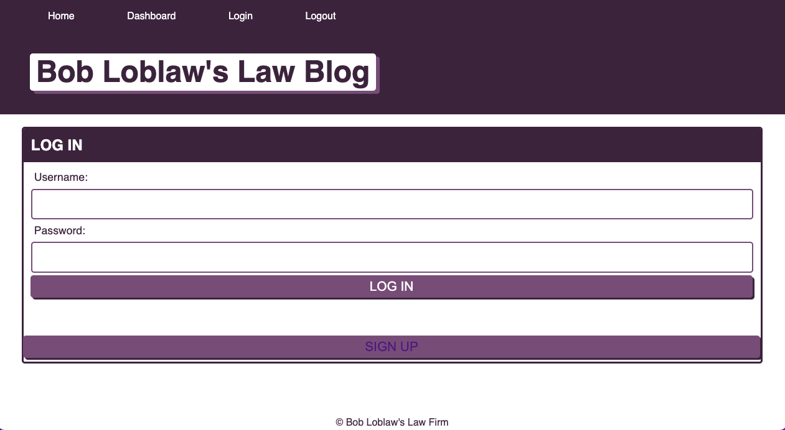

# Tech Blog (aka Bob Loblaw's Law Blog)

## Description

Once complete, this project will be a collaborative blog/forum that allows users to sign up, log in, create posts, and comment on posts.

## Table of Contents

- [Installation](#installation)
- [Usage](#usage)
- [License](#license)
- [Contributions](#contributions)
- [Testing](#testing)
- [Questions](#questions)

## Installation

Installation requires many dependencies. Contact me for further installation instructions.

## Usage

Under construction.

## License

Copyright © 2022 [Caren Merz](https://github.com/cammeer).  
This project is [MIT](https://github.com/cammeer/next-progress-bar/blob/main/LICENSE) licensed.

## Contributions

I was the only contributor for this project so far. If you would like to contribute, see my email below.

## Tech

- JavaScript
- Node.js
- Express.js
- MySQL
- Sequelize
- Heroku
- JawsDB MySQL

## Testing

Not required for this project.

## Any Questions?

This project was created by me: [cammeer](https://github.com/cammeer)

Contact me with any questions at: [caren@merzhaus.org](caren@merzhaus.org)
